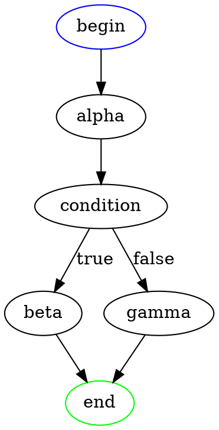
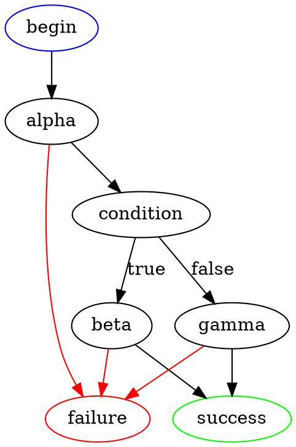
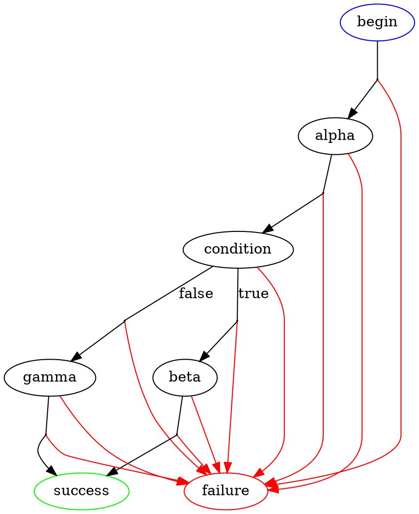
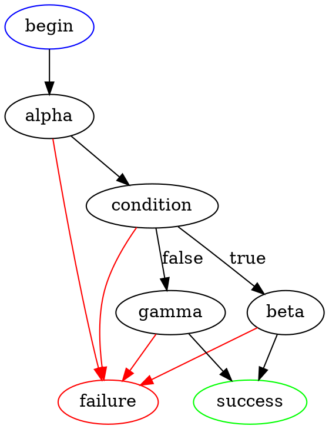
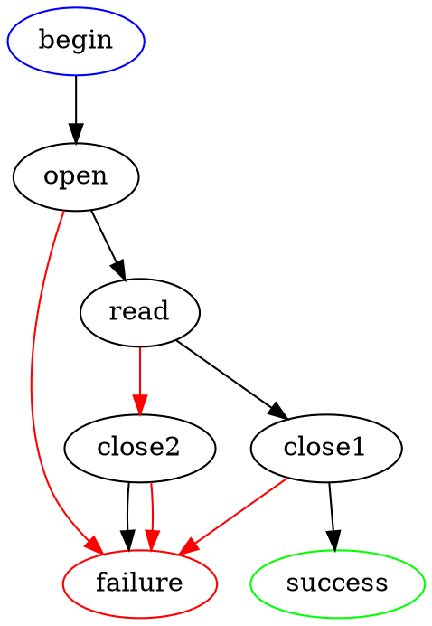
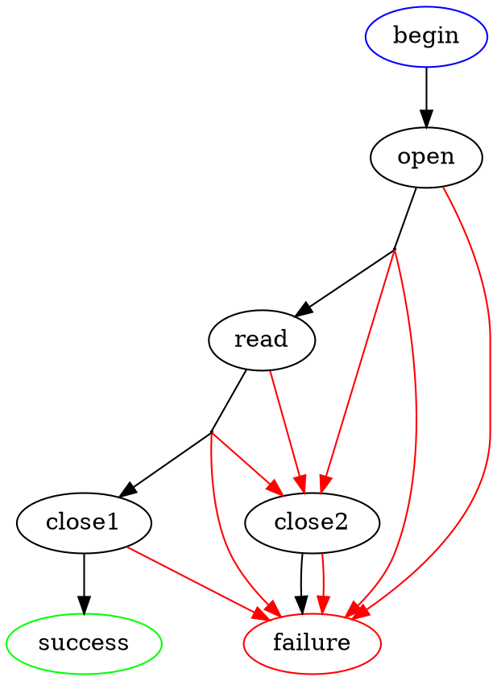
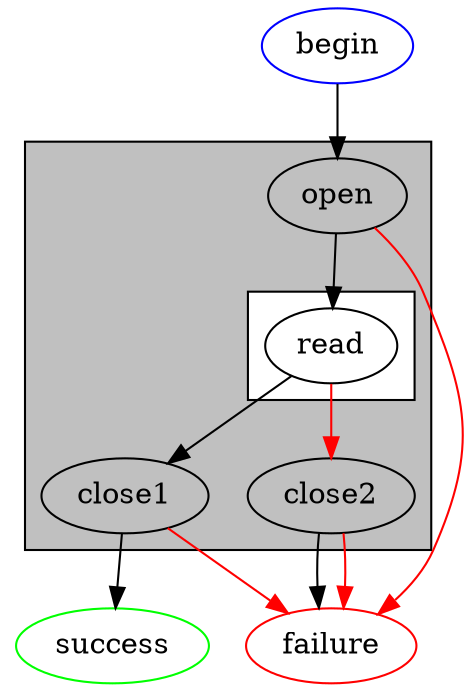
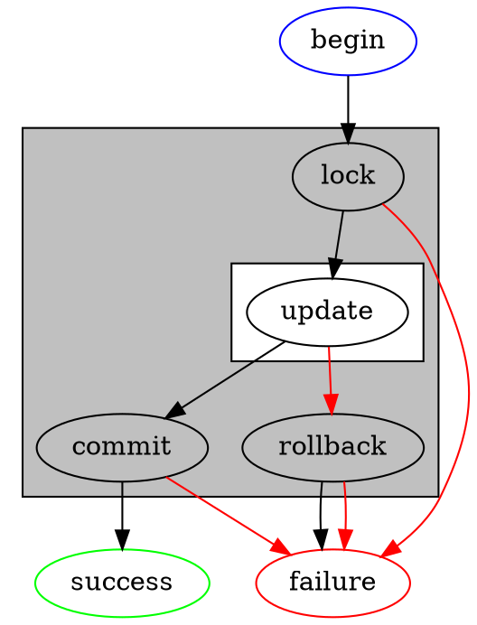

# Reasoning with exceptions

## Exception support

Exception support can be categorized into three cumulative tiers:

  * **None**: Exceptions cannot occur at all / no support for exceptions.

  * **Synchronous**: Exceptions can occur, but only at specific identifiable locations in the current thread's code.

    For example, it can happen from a `throw` statement, or from a function that contains a `throw` statement (possibly indirectly).  However, an empty function is guaranteed to never throw an exception, nor can exceptions occur in the gaps between statements.

  * **Asynchronous**: Exceptions can occur at any moment from anywhere. Even an empty function can throw an exception, and exceptions can occur in the gaps between statements.

    Asynchronous exceptions are generally associated with concurrency.  One thread may throw an exception to another thread -- where this exception gets received can be nondeterministic.

Specific examples:

  * In C, setjmp/longjmp can emulate synchronous exceptions.
  * C++ exceptions are synchronous.
  * POSIX signals are similar to asynchronous exceptions in concept, but unlike asynchronous exceptions, multiple signals of the same kind can be coalesced.
  * Go panics are synchronous exceptions.
  * The IO monad in Haskell supports both synchronous and asynchronous exceptions.
  * Python exceptions are mostly synchronous, except those raised from a signal handler (e.g. KeyboardInterrupt) or internal errors in the runtime (e.g. MemoryError).

## Exception safety

From the three tiers of exception support, one can analogously derive three cumulative tiers of exception safety:

  * Non-exception-safe: The code does not tolerate any sort of exceptions.  Any exceptions that occur may break invariants, corrupt data, cause a memory leak, etc.
  * Sync-exception-safe: The code tolerates synchronous exceptions, but not asynchronous ones.
  * Async-exception-safe: The code tolerates both asynchronous and synchronous exceptions.

## Control flow graphs for exceptional code

Code without exceptions can be naively translated into a control flow graph (CFG).

With synchronous exceptions, translating code into CFG requires adding an exceptional path to all fallible operations.

Asynchronous exceptions: Translating code into CFG requires adding an exceptional path to all fallible and non-fallible operations, as well as the transitions between every operation.

For example, consider the following code:

    alpha()
    if condition then
        beta()
    else
        gamma()
    end

Without exceptions, you get this simple CFG:

With exceptions, you get something a little more complicated (assuming `alpha`, `beta`, and `gamma` are all fallible):

The red lines indicate the path taken when there is an error.

With asynchronous exceptions, there's now an exceptional path for every arrow, as well as `condition`:

Realistically, drawing the CFG in this way is both messy and unnecessary.  *Usually*, the exceptional paths taken for the arrows are the same as those of their adjacent nodes; in this case, they are generally uninteresting to show and don't need to be drawn.  It suffices to show the simpler diagram:

and just make a mental note that there is an *implied* exceptional path from every arrow.

However, there are situations where the exception paths can differ between nodes.  Consider this code:

    let file = open()
    try
        read(file)
    finally
        close(file)
    end

The synchronous CFG looks like this:

So far so good.  But if we try to draw the asynchronous CFG, we run into difficulties: There are two possible exceptional paths from the arrow between `open` and `read` (and similarly from the arrow between `read` and `close1`):

This is bad: it's an indication that this exception handling strategy is not async-exception-safe.

## Masking exceptions

There is no way to make the preceding code safe in the presence of asynchronous exceptions without introducing a new primitive, called *masking*.  A program can choose to mask asynchronous exceptions for some region of code:

    mask
        ...
    end

While masked, the delivery of asynchronous exceptions is suspended: any asynchronous exception received will be placed on hold.

When the masking ends, any pending asynchronous exceptions will be immediately delivered to the current thread, and further asynchronous exceptions will deliver as normal.

While masked, the program may also choose to temporarily unmask asynchronous exceptions for some region of code:

    unmask
        ...
    end

At the beginning of `unmask`, any pending asynchronous exceptions are delivered immediately, and further asynchronous exceptions within the region will deliver as normal.

Note that masking does not affect synchronous exceptions in any way.  An action that fails synchronously within a masked region will trigger the exceptional path as usual.

The previous code can be made async-exception-safe by careful use of masking:

    mask
        let file = open()
        try
            unmask
                read(file)
            end
        finally
            close(file)
        end
    end

This leads to the following async CFG:

where grey boxes indicate masking and white boxes indicate unmasking.

## Transactions

    mask
        let transaction = lock()
        try
            unmask
                update(transaction)
            end
        catch(exception)
            rollback(transaction)
            throw(exception)
        end
        commit(transaction)
    end

TODO: Nested masking.