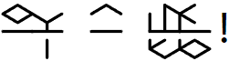
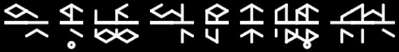
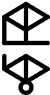
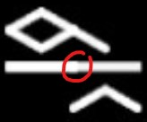
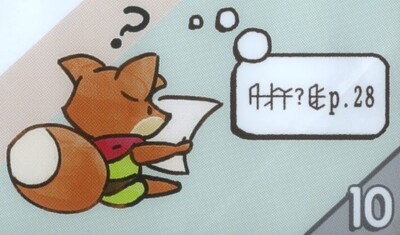
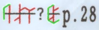
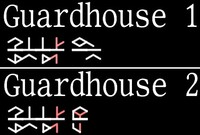
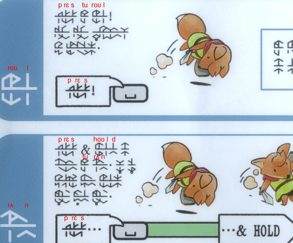
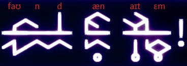
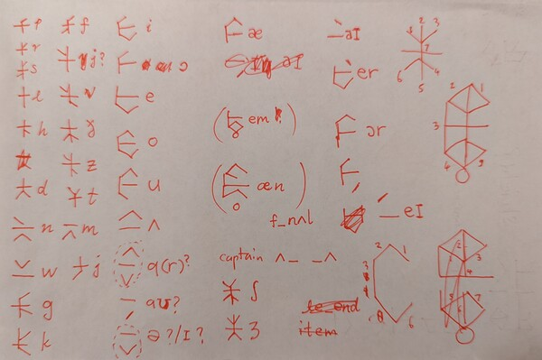

# Deciphering Tunic

Tunic has a secret language that shows up throughout the game. After hearing rumors that the language is related to the sounds of English in some way, I couldn't help but try my hand at solving this puzzle.

I spent a few hours playing through the first few zones and learning the basic gameplay, collecting screenshots of every Tunic text I could find. Since I only played a small fraction of the game, I didn't have as many clues as I would have otherwise. (Supposedly there's an instruction page that makes decoding the language much easier... but I didn't know that existed at the time!)

## Coarse structure

The language of Tunic is presented in isometric shapes, much like the game itself. The first challenge was to discern the subcomponents of this language. I really needed to know what makes up a "character" (smallest divisible unit) in this language before I could even begin to parse it. The typical Tunic looks like this:

From all the texts I had seen, the smallest piece seemed to follow this stencil:

I will call this sort of unit a **symbol** from here on. I had other reasons to suspect that symbols were meaningful units in the language: the in-game rendering had some imperfections at the joints that made the symbol boundaries rather apparent:

It seemed that multiple symbols could be placed adjacent to each other to form **words**, much like in English. Whether each Tunic word corresponds to a single English word was not known to me at the time. However, if I assumed that was true, each Tunic word seemed to contain much fewer symbols than a typical English word would contain letters.

Separately, although symbols seemed like the smallest parts appearing in isolation, that didn't necessarily mean that a symbol couldn't have meaningful subcomponents. I suspected there was deeper structure within each symbol because there were very few repeated symbols in the text. If each symbol had corresponded to a basic phoneme, I would only expect a [few dozen](https://en.wikipedia.org/wiki/English_phonology#Phonemes) unique symbols, but the texts seem to have far more variation than that!

My first guess was that maybe the upper and lower portions needed to be interpreted separately. The upper and lower parts are quasi-symmetric and cleanly divided by the central bar. Each part has about 7-ish togglable segments, including the weird subscript circle. This means in theory you could have 27 = 128 possible combinations for both the upper and lower pieces, much like ASCII. I almost wondered if they were related to 7-segment LEDs...

Unfortunately, even after decomposing symbols into the upper and lower parts, the number of unique parts still seemed huge based on the corpus I had. I didn't have much luck with this path.

## Specific phrases

Having exhausted what I could glean by examining the corpus in aggregate, I thought I might have more luck focusing on just a few specific phrases. I sifted my collection to find fragments of Tunic where I had good guesses of their meaning. Unfortunately, the developers didn't make this easy! While there's tons of English interleaved with Tunic phrases, there are very few places where the Tunic and English text are direct translations of another.

### Page 10

The breakthrough occurred when I tried to decode this thought bubble on page 10 of the instruction manual:

There's no English text, but given the context and the imagery, there isn't a lot of possibilities:

> [Lost/Confused/What/Huh]? [See/Visit/Find/Look] p. 28

*Lost* seemed rather plausible for the first word, given that page 28 was a map. With a bit of squinting, I noticed the 2nd symbol looked vaguely like an *S*, while the third symbol looked quite like a *T*. Coincidence?

If this is indeed *Lost*, does that make the first symbol an *L*? It does sort of look like a Greek lambda (λ). Does that mean that the first word translates to *LST*? There didn't seem to be any vowels, so are vowels are supposed to be inferred from context in this language?

Leaving aside the first word for a bit, I also made a guess that the second word was *See* since it had only one symbol. But if the earlier word was in fact *LST*, how come the *S* in the first word doesn't look like the *S* in the second word?

Upon closer inspection, I noticed that the *S* in the first word does appear in the second word, just with some extra segments surrounding it! It was at this point that I made the crucial realization: instead of decomposing the symbol into upper and lower parts, I should try to *decompose them into inner and outer parts*.

It seemed it would make the most sense to assign the consonant to the inner part of a symbol and vowels to the outer part:

Red marks the consonant parts while green marks the vowel parts. This scheme matched my expectations perfectly:

- The *L* in *Lost* has a vowel (/ɔ/) immediately after. (Incidentally, this means what I had thought regarding its similarity to lambda no longer made sense. However, it does look like a lower case *L* in English now!)
- Neither *S* nor *T* in *Lost* has any vowels after it.
- The *S* in *See* definitely has a vowel (/iː/) after it.

I got quite lucky with this phrase: the words had mostly consonants instead of vowels, so I could make an almost direct correlation to English consonants. Without such a clean example, I probably would have remained stuck for a bit longer.

Now, even though everything made sense for this phrase, I still treated it as a hypothesis at the time. Given that I had just made a ton of speculative conjectures around the meaning of the phrase, the mapping to English, and the decomposition of symbols, I wasn't all that confident in the correctness of this idea. I needed to to collect more evidence to confirm.

### Guardhouses

A second place where I was able to guess the meaning was the titles for the *Guardhouse 1* and *Guardhouse 2* zones:

The first words are the same for both, while the second words are different, so it seemed reasonable to suspect that the first word is *Guardhouse* while the second word is *One* and *Two* respectively. The information I learned from page 10 helped confirm this:

- *Guardhouse* ends with /s/. The last symbol matches the same *S* symbol from *Lost*.
- *Two* starts with /t/. The first symbol contains the same *T* consonant from *Lost*.

I separated the sounds of *Guardhouse* into four pieces /gɑr/, /d/, /haʊ/, and /s/, which aligns with the four symbols pretty well. Hence, from this one word, I was able to guess the Tunic shapes for /g/, /ɑr/, /d/, /h/, and /aʊ/.

At the time, I wasn't entirely sure how to deal with diphthongs like /ɑr/ and /aʊ/, particularly since these sounds often have significant dialectal variations. For all I knew, maybe Tunic was based on Received Pronunciation, in which case it would be /ɑː/ instead of /ɑr/. Maybe there's some slack in the vowel representations?

### Page 13

Yet another place where I gleaned a lot of information was page 13 of the instruction manual:

The instructions say *... & HOLD*, preceded by an unknown Tunic word. From the previous information, I concluded that this unknown word should end in /s/. There's not many such verbs that make sense on a keyboard key. I guessed *Press* /prɛs/, which then allowed me to learn the consonant /r/. That was incredibly useful given how frequently /r/ shows up in English.

The word *Press* shows up several times on this page. In the lower paragraph, the ampersand (*&*) suggested that the following word is probably *hold*. The /h/ symbol matches the one from *Guardhouse*, while the /l/ symbol matches the one from *Lost*.

In the upper paragraph, the /t/ consonant is seen in the word after *Press*. In the word following that, there are /r/ and /l/ consonants. Hence, the first sentence is likely *Press to roll!* The fact that *Roll* is seen in the section title on the left side corroborates this.

### Loot popup

For the next few hours, I repeated the same guess-and-decode procedure over other phrases in my collection, uncovering more and more of the Tunic symbols and building more and more confidence in the overarching scheme. Turns out, once I've gotten the ball rolling by decoding the first few symbols, finding the rest of them became much easier.

Along the way, I also figured out the mysterious circle. The circle shows up most prominently in the popup you get for looting an item:

The circle represents neither consonant nor vowel, but instead an inversion of the ordering: instead of consonant-then-vowel, it becomes vowel-then-consonant. Thus, instead of /næ taɪ·mɛ/, they should be interpreted as /æn aɪt·ɛm/ (*an item*).

(You might notice that the standard IPA for *item* is /aɪtəm/ with an /ə/, not /aɪtɛm/ with an /ɛ/. This is one of the vexing questions with Tunic that I still don't have a good answer to. I suspect Tunic just doesn't have weak vowels like /ə/. Tunic appears to always strengthen /ə/ into either /ʌ/, /ɛ/, /ɪ/, or /ʊ/, depending on how the word is actually spelled.)

## Building the chart

By the end of the night, I managed compile an incomplete chart of consonants and vowels. These were my original notes, which still had a few errors:

You can see in the notes that I had also started thinking about how to encode Tunic symbols in software, assigning numbers to each line segment. This would later become [tunic-encoder](https://rufflewind.com/_urandom/tunic-encoder).
